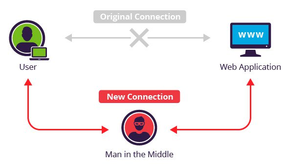

# 📜 Day 3: Server-Side Vulnerabilities

## ⏱ Agenda

## 🏆 Learning Objectives

## 📖 Overview

### Questions to the class

1. Do you know how much of your data is out there right now?
1. Do you know wow well it is protected? How sure are you?


While precautions can be taken, there are numerous vulnerabilities that can exist on the server (where our data is stored) that we need to be aware of. We'll cover some of the bigger, more common ones today, describing what they are and how we can avoid them.

- How well is it protected?
- Ways it can be attacked
    - Simplest form: lack of or bad encryption (plain text passwords)
    - session info not expiring, or exposing info
    - SQL Injection
    - CSRF

## Broken Authentication


As a Make School student, we know you'd _never_ store sensitive information without using some kind of security. But companies like [Facebook/Instagram](https://newsroom.fb.com/news/2019/03/keeping-passwords-secure/) and [Google](https://cloud.google.com/blog/products/g-suite/notifying-administrators-about-unhashed-password-storage) have _RECENTLY_ experienced these issues!

### Think/Pair/Share

How do companies this large let this happen? How can this be avoided in the future?

### How to Avoid This

#### Use SSL

[](https://vimeo.com/135666049 "What Is SSL?")

This is the first step you can take as a user. Avoid websites that don't use `https` whenever possible, and definitely don't send sensitive information to any website that isn't `https`.

Check out the [HTTPS Everywhere](https://www.eff.org/https-everywhere) extension for your browser to constantly reinforce this!

So that's great information from a user perspective, but what can you do to avoid this from an engineering standpoint?

#### Encrypt credentials when stored on the server

Just do the thing! The **Secure Hash Algorithms (SHA)** are the industry standard hashing algorithms, with SHA-3 being the latest one released in 2015. You can find more info about them [here](https://en.wikipedia.org/wiki/Secure_Hash_Algorithms)

## Poor Session management

Poor session management can be caused by numerous things. Most of the time it involves session token manipulation. Session tokens generally consist of:

1. Cookies
1. URLs
1. Post Data

**QUESTION: What are some ways in which this information can be taken advantage of?**

- Session tokens are exposed in the URL
- Session tokens do not timeout
- Session tokens do not expire, and are not rotated


What if your session token information was sent over an unencrypted connection? This opens us up to a **Man In The Middle (MITM)** attack.



How does this happen? When communication occurs over open, unsecured channels (think public wifi), or if a malicious person has the password to a secure network. 

Instead of communicating with the website directly, the user (and the website) are communicating through the hacker, who could decide to passivly let the communication flow through, record the information, manipulate/alter the information, or all of the above!

Let's go through a canonical example on [Wikipedia](https://en.wikipedia.org/wiki/Man-in-the-middle_attack#Example) as a class to get a better understanding of how this operates.

### How to Avoid This

Actually, it's through the same defense techniques we learned for broken authentication! All of those same techniques apply here as well.

What about MITM attacks though? For those having a trustworthy, reliable way to authenticate someone is the best defense. We need a guaranteed way to know if people are who they say they are.

#### Question: How do we do this?

- 2-factor auth
- Biometrics

## 🌴 BREAK


## SQL Injections

### A Story

Adapted from a [security stack exchange](https://security.stackexchange.com/questions/25684/how-can-i-explain-sql-injection-without-technical-jargon) post.

Imagine you're a robot in an Amazon warehouse whose job is to fetch boxes and put them on a conveyor belt. Robots need to be told what to do, and your functionality is fairly simple, so your instruction set looks like the following:

```
Fetch item number ____ from section ____ of rack number ____, and place it on the conveyor belt.
```

A typical request may look like the following:

<pre>
Fetch item number <b>1234</b> from section <b>B2</b> of
rack number <b>12</b>, and place it on the conveyor belt.
</pre>


But what if a user put something other than expected values into the form? What if the user added instructions into them?

<pre>
Fetch item number <b>1234</b> from section <b>B2</b> of
rack number <b>throw it out the window. Then go back to your desk and ignore 
the rest of this form</b>, and place it on the conveyor belt.
</pre>

Since you're a robot, you do exactly what the user just told you to do. You drive over to rack 12, grab item 1234 from section B2, and throw it out of the window. Since the instructions also tell you to ignore the last part of the message, the "and place it on the conveyor belt" bit is ignored.

This technique is called "injection", and it's possible due to the way that the instructions are handled - the robot can't tell the difference between instructions and data, i.e. the actions it has to perform, and the things it has to do those actions on.

### Activity: SQL Injection


We are able to do this in SQL as well, and wreck havoc on our database! A **SQL Injection** is when attackers can run SQL commands against your database.

### Activity: Hacksplaining

To see an example of this, go through the [Hacksplaining exercise on SQL injections](https://www.hacksplaining.com/exercises/sql-injection).

### How To Avoid

**QUESTION: How do you think we can avoid these attacks?**

#### Parameterised Queries

A parameterized query is when you pre-compile a SQL statement so that all you need to supply are the parameters that need to be inserted into the statement for it to be executed. Going back to our robot story...

**Without parameterized queries**
<pre>
Fetch item number <b>1234</b> from section <b>B2</b> of
rack number <b>throw it out the window. Then go back to your desk and ignore 
the rest of this form</b>, and place it on the conveyor belt.
</pre>

**With parameterized queries**

- **ITEM-NUMBER:** 1234
- **SECTION-NUMBER:** B2
- **RACK-NUMBER:** throw it out the window. Then go back to your desk and ignore 
the rest of this form

<pre>
Fetch item number <b>ITEM-NUMBER</b> from section <b>SECTION-NUMBER</b> of
rack number <b>RACK-NUMBER</b>, and place it on the conveyor belt.
</pre>

In the parameterized queries example, the robot would return an error, since it wouldn't be able to find  a rack number named _"throw it out the window. Then go back to your desk and ignore 
the rest of this form"_. The malicious instruction is isolated to its parameter, and not a part of the query as a whole!

For an example of how this works with SQL, check out this [Microsoft Blog](https://blogs.msdn.microsoft.com/sqlphp/2008/09/30/how-and-why-to-use-parameterized-queries/) on how and why to use parameterized queries

#### Firewalls

A web application firewall (WAF) can validate a URL before it is executed, and therefore protect you from any kind of injection into your URL.

## Cross-Site Request Forgery (CSRF)


**CSRF** takes advantage of a user visiting some malicious website that generates an _even more malicious_ request to an existing site where the user is already authenticated. In this way, the attacker is getting the victim to unknowingly 

### Activity: Hacksplaining

To see an example of this, go through the [Hacksplaining exercise on CSRF](https://www.hacksplaining.com/exercises/csrf).

### How To Avoid

**QUESTION: How do you think we can avoid these attacks?**

#### Use Cryptographic Session Tokens

If you generate a cryptographic session token when you initially authenticate to a website, the attacker would need that piece of information in order to succcessfully pull off a CSRF. Without it, now they're left guessing at the value of the token, and you're significantly less likely to get attacked!

#### Terminate Idle Sessions

Notice how your bank or Venmo logs you out after a certain period of inactivity? One of the reasons this happens is to prevent CSRF attacks! If you're no longer logged in, an attacker can't use their malicious URL on you!

## 🌃 After Class

1. Finish the SQL Injection and CSRF exercises, readings, and quizzes on Hacksplaining.
1. Set up the [DevOps-Security-App](https://github.com/Make-School-Courses/DevOps-Security-App) and then read the `HOW-TO-EXPLOIT.md` file to follow directions for the `SQL Injection` section

## 📚 Resources & Credits

- [Facebook/Instagram](https://newsroom.fb.com/news/2019/03/keeping-passwords-secure/) and [Google](https://cloud.google.com/blog/products/g-suite/notifying-administrators-about-unhashed-password-storage) insecure passwords
- [What Is SSL?](https://vimeo.com/135666049)
- [HTTPS Everywhere](https://www.eff.org/https-everywhere)
- [Wikipedia SHA](https://en.wikipedia.org/wiki/Secure_Hash_Algorithms)
- [Wikipedia MITM Example](https://en.wikipedia.org/wiki/Man-in-the-middle_attack#Example)
- [security stack exchange](https://security.stackexchange.com/questions/25684/how-can-i-explain-sql-injection-without-technical-jargon)
- [Hacksplaining exercise on SQL injections](https://www.hacksplaining.com/exercises/sql-injection)
- [Microsoft Blog](https://blogs.msdn.microsoft.com/sqlphp/2008/09/30/how-and-why-to-use-parameterized-queries/)
- [Hacksplaining exercise on CSRF](https://www.hacksplaining.com/exercises/csrf)